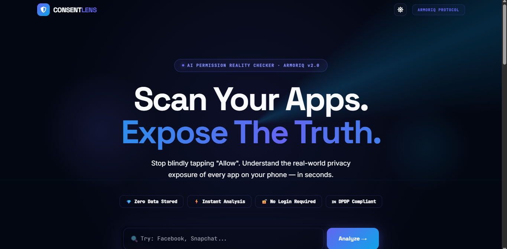
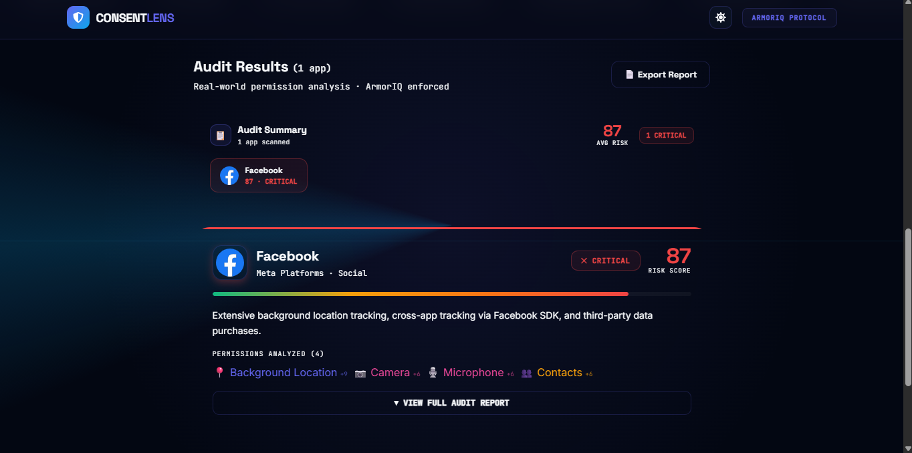
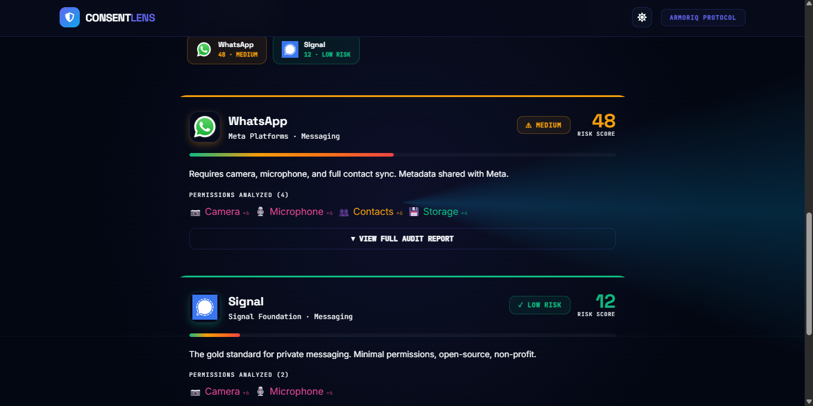

# 🛡️ ConsentLens

### Know What Your Apps Really Know About You

ConsentLens is an AI-powered App Permission Reality Checker that helps users understand the privacy risks associated with the apps they use every day.

Instead of blindly clicking **"Allow"**, users can analyze apps such as Instagram, WhatsApp, Truecaller, Facebook, Telegram, and more to see what permissions they request and how those permissions impact privacy.

---

## 🚀 Features

### 🔍 App Permission Analysis
Analyze one or multiple apps simultaneously.

Example:

Instagram, WhatsApp, Truecaller

---

### 📊 Privacy Footprint Score

Every app receives a privacy score based on the permissions it requests.

| Risk Level | Meaning |
|------------|----------|
| 🟢 LOW | Minimal privacy risk |
| 🟡 MEDIUM | Moderate privacy risk |
| 🟠 HIGH | Significant privacy concerns |
| 🔴 CRITICAL | Highly sensitive permissions detected |

---

### 🛡️ Risk Assessment

ConsentLens evaluates permissions such as:

- Location
- Contacts
- Camera
- Microphone
- SMS
- Phone
- Storage

and estimates privacy exposure.

---

### 📋 Data Collection Insights

See exactly what categories of information an app may access.

Example:

- Location
- Contacts
- Camera
- Microphone

---

### 💡 Privacy Recommendations

Receive actionable recommendations such as:

- Disable unnecessary permissions
- Review privacy settings
- Limit background access
- Revoke unused permissions

---

### ⚖️ App Comparison

Compare multiple apps side-by-side.

Example:

Instagram vs WhatsApp vs Truecaller

Compare:

- Privacy Score
- Permission Usage
- Risk Level

---

## 🏗️ Project Architecture

```text
Frontend (React + Vite + Tailwind)
            │
            ▼
      Axios API Calls
            │
            ▼
Backend (FastAPI)
            │
            ▼
 Permission Database
            │
            ▼
 Risk Analysis Engine
```

---

## 🛠️ Tech Stack

### Frontend

- React 18
- Vite
- Tailwind CSS
- Axios
- React Icons

### Backend

- FastAPI
- Python
- Pydantic
- Uvicorn

---

## 📂 Project Structure

```text
ConsentLens
│
├── frontend
│   ├── src
│   ├── components
│   ├── pages
│   ├── services
│   └── App.jsx
│
└── backend
    ├── app
    ├── permissions.py
    └── main.py
```

---

## ⚙️ Installation

### Clone Repository

```bash
git clone https://github.com/sg721642/CONSENTLENS.git
```

### Frontend

```bash
cd frontend

npm install

npm run dev
```

Frontend runs on:

```text
http://localhost:5173
```

---

### Backend

```bash
cd backend

python -m venv venv

venv\Scripts\activate

pip install -r requirements.txt
```

Run backend:

```bash
uvicorn app.main:app --reload
```

Backend runs on:

```text
http://127.0.0.1:8000
```

Swagger Docs:

```text
http://127.0.0.1:8000/docs
```

---

## 📸 Screenshots

### Home Page



### Analysis Result



### App Comparison



---

## 🔒 Privacy First

ConsentLens follows a privacy-first design.

- No personal user data is stored.
- Only app names are analyzed.
- No user tracking.
- Local permission risk evaluation.

---

## 🎯 Future Improvements

- Gemini AI-powered privacy explanations
- Play Store permission scraping
- Real-time app database
- Exportable PDF privacy reports
- Browser extension support
- Advanced privacy scoring model

---

## 👥 Team

Built during the **NeuroX Hackathon 2026** by Team **3 Musketeers**.

**Team Members**

- Satyam Gupta
- Deepak Kumar
- Chiranjivi Panda

---

## 📜 License

MIT License
## 📜 License

MIT License
